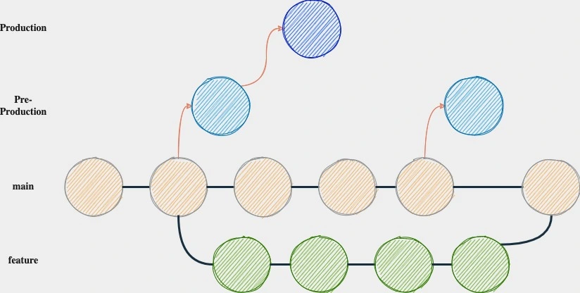

# Software_Engineering_I

## Branching Strategy

This repository uses a GitLab Flow branching strategy to manage code development and releases. Here's a brief overview of the process:

### Main Branch:
Represent the working state. It is the basis for a release. The main branch should always be in a deployable state.

### Feature Branches:
Feature branches are created from the main branch and merged back to main with a merge request.

### Pre Production:
Commits on pre production deploy the pre-production environment. You should only merge main into the pre-production.

### Production
Commits on production deploy the production enviromnet. You should only merge pre-production into production.

## Contribution Guide

### Commit Messages
A commit should have the following format {type} - [{ticket_id}] {message}.

    git commit -m "fix - [backlog#123] adjust files for task XYZ"

|Type|Description|
|------|-------------|
|feature|Adding new functionality to the application| 
|fix|Fixing an issue| 
|refactor|Refactor parts of the code|  

