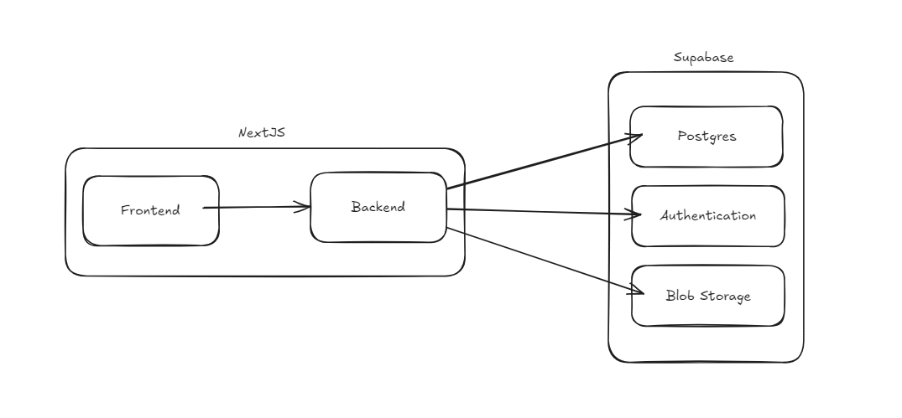

# Software_Engineering_I
Notice: dies ist ein Mock Projekt für die Uni, um den Workflow in modernem Software Engineering nahezubringen. Diese Website erfüllt keine rechtlichen Vorschriften an Websiten, da diese durch Lehrzwecke nicht erfüllt werden müssen.

Bitte lies dieses Dokument ausführlich bevor irgendwelche Pull-Requests für dieses Repo erstellt werden. Da es die Infrastrukturentscheidungen und Engineering Prinzipien für dieses Projekt vermittelt.

## Engineering Principles
Als Contributer zu diesem Repository halte mich an diese Richtlinien in besten Wissen und gewissen

### Locality of Behavior
Ich verzichte auf Abstraktion hinter Methoden oder Dateien und schreibe Code immer dahin wo er auch benutzt wird.
### Write everything twice
Ich ziele nicht agressiv auf DRY Code ab, sondern sehe Duplikation als wichtiges Mittel um nicht die falschen Abstraktionen zu nutzen. Die Grundregel ist, dass ich zwei mal wiederhole bis ich auf eine Abstraktion zurückgreife um die Duplikation zu entfernen.
### Don't repeat yourself
Ich wiederhole nicht selbe Repräsentation von Daten / Logik. Ich behalte im Hinterkopf, dass es Duplikation durch Zufall gibt und halte mich an die WET-Regel, wenn ich mir nicht sicher bin, dass das wirklich die gleichen Daten / Logik ist.
### Easy to change
Ich halte das oberste Gut, dass der Code einfach zu editieren, löschen und ergänzen ist bei. Ich hinterfrage ob meine Änderungen weiter das ETC-Prinzip erfüllen.
### Vererbungsebenen
Sollte ich auf Vererbung zurückgreifen, achte ich darauf, dass sie nicht tief ist sondern flach. Vererbung sollte nie mehr als eine Ebene tief sein.
### Keep it simple, stupid
Ich versuche immer den leichteste Code möglich zu schreiben. Auch wenn es coole / schlaue Lösungen zu einem Problem gibt, halte ich im Blick, dass es einfach verständlich und leserlich ist.
### No silver bullet
Mir ist bewusst, dass alle Richtlinien nicht der heilige Grahl sind und ich in der Entwicklung immer selber evaluieren muss, was für diesen Fall die beste Lösung ist. Wenn ich alleine nicht weiter weiß, greife ich auf die Schwarmintelligenz des Teams zurück.

## Branching Strategy

This repository uses a GitLab Flow branching strategy to manage code development and releases. Here's a brief overview of the process:


### Main Branch:
Represent the working state. It is the basis for a release. The main branch should always be in a deployable state.

### Feature Branches:
Feature branches are created from the main branch and merged back to main with a merge request.

### Pre Production:
Commits on pre production deploy the pre-production environment. You should only merge main into the pre-production.

### Production
Commits on production deploy the production enviromnet. You should only merge pre-production into production.

## Contribution Guide

### Commit Messages
A commit should have the following format {type} - [{ticket_id}] {message}.

    git commit -m "fix - [backlog#123] adjust files for task XYZ"

|Type|Description|
|------|-------------|
|feature|Adding new functionality to the application| 
|fix|Fixing an issue| 
|refactor|Refactor parts of the code|  


## Versions with tags 

### create tag
    git tag "v1.0.0"

### major.minor.patch 
- Major version is increases if there are **incompatible changes** in the API or the behaviour of the software
- Minor version is increased when **new functions** are added that are downward compatible.
- Patch version is increased when **bugs are fixed** or small, backwards-compatible changes are made.

# Release Schedule
Die Software wird jeden Dienstag wöchentlich released. Wenn in diesem Release-Schedule kein Ticket umgesetzt wird, dann
wird die Woche ausgesetzt. Wenn Dienstag ein Tag an dem nicht gearbeitet wird, dann wird von dem Team evaluiert, wann anstelle
released werden sollte.

# User Flows
Hier werden die user flows aufgezeigt, welche benötigt werden um die Software zu navigieren. MIt diesen können Desing und Routing Entscheidungen begründet werden. Die user flows sollten niemals zu komplex werden, weil dass eine schlechte UX für die Software schlussfolgert.

# Infrastruktur
In diesem Abschnitt wird die Infrastruktur von dem Projekt vorgestellt und begründet


# Frontend / BFF Architektur
Für das Frontend wurde sich für NextJS entschieden. Damit gibt es ein React-Frontend und ein NodeJS BFF. Mit dem NodeJS können die Microservices für die einzelnen Requests logisch verbunden werden.

# Backend (Microservices Architektur)
Für das Backend wird auf eine Microservice Architektur genutzt, diese besteht aus einer PostgreSQL-Datenbank, einem
Authentication-Server und eine S3 Blob-Storage. 

## Postgres Datenbank


## S3 Storage
Hier werden die Bilder gespeichert

# Datenbank Schema und Typen

## Datenbank

## Interfaces

# Setup der Entwicklungsumgebung
**Anforderungen**
- Docker (Desktop oder Engine)
- NodeJS v20
- npm

**Starten von der Applikation in Local**
- Docker sollte laufen.
- auf die Root Ebene des Projektes navigieren
- ```npm run i``` um alle Dependencies zu installieren
- ```npm run supabase``` ausführen um das Backend zu starten.
- ```npm run dev``` um den NextJS Dev-Server zu starten.
- als Nutzer user1@example.com mit dem Passwort asdfasdf anmelden
